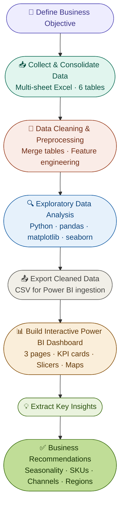

# 📊 Regional Sales Performance Analysis & BI Dashboard

> **End-to-end analytics project** — Python EDA + interactive Power BI dashboard surfacing $1.2 bn in Acme Co. sales data across 5 years, 4 U.S. regions, 30+ products, and 3 sales channels.

---

## 🗂️ Project Structure

```
regional-sales-analysis/
├── data/
│   ├── raw/                          # Original Excel workbook (6 sheets)
│   └── processed/                    # Cleaned & merged dataset (CSV export)
├── notebooks/
│   └── EDA_Regional_Sales_Analysis.ipynb
├── dashboards/
│   └── Regional_Sales_Dashboard.pbix
├── reports/
│   └── PPT_Regional_Sales_Analysis.pptx
├── images/
│   ├── dashboard_executive_overview.png
│   ├── dashboard_product_channel.png
│   └── dashboard_geo_customer.png
└── README.md
```

---

## 🧩 Business Problem

Sales teams at Acme Co. lacked a **clear, data-driven understanding of regional performance**, making it difficult to:
- Identify growth opportunities across products, channels, and geographies
- Understand seasonal revenue swings for proactive planning
- Evaluate channel profitability and optimise resource allocation

**Goal:** Leverage 5 years (2014–2018) of historical sales data to pinpoint growth levers, uncover seasonality patterns, and support strategic decision-making through an interactive, self-serve dashboard.

---

## 📦 Dataset Overview

| Attribute | Detail |
|-----------|--------|
| Source | Multi-sheet Excel workbook |
| Tables | Sales, Customers, Products, Regions, State-Region, Budgets |
| Period | 2014 – 2018 |
| Orders | ~64,000 |
| Total Revenue | $1.2 billion |
| Geography | All U.S. states across 4 regions |
| Channels | Wholesale, Distributor, Export |
| Products | 30+ SKUs |

> ⚠️ No missing values or duplicate rows were found after preprocessing.

---

## 🛠️ Tech Stack

| Layer | Tools |
|-------|-------|
| Data Analysis | Python 3 (pandas, numpy) |
| Visualisation | matplotlib, seaborn |
| Notebook Environment | Google Colab |
| BI Dashboard | Microsoft Power BI Desktop |
| Presentation | Microsoft PowerPoint |
| Version Control | Git / GitHub |

---

## 🔄 Project Workflow



---

## 🧹 Data Preprocessing & Feature Engineering

Key steps applied to prepare the dataset:

1. **Set correct headers** on the State-Region mapping table
2. **Merged 6 tables** — Sales ← Customers, Products, Regions, State-Region, Budgets
3. **Dropped redundant columns** and standardised all names to lowercase
4. **Restricted budget column** to 2017 orders only (budget data only existed for 2017)
5. **Engineered new columns:**
   - `total_cost = quantity × unit_cost`
   - `profit = revenue − total_cost`
   - `profit_margin_pct = (profit / revenue) × 100`
   - `order_month`, `order_month_name`, `order_month_num` from `order_date`

**Final dataset schema:**

| Category | Columns |
|----------|---------|
| Identifiers | `order_number`, `order_date`, `customer_name`, `channel`, `product_name` |
| Financials | `quantity`, `unit_price`, `revenue`, `cost`, `profit`, `profit_margin_pct` |
| Calendar | `order_month_name`, `order_month_num`, `order_month` |
| Geography | `state`, `state_name`, `us_region`, `lat`, `lon` |
| Planning | `budget` (2017 only) |

---

## 📊 EDA — Key Analyses Performed

| # | Analysis | Chart Type | Key Finding |
|---|----------|------------|-------------|
| 1 | Monthly revenue trend | Line chart | Jan peaks at ~$124M; April dips to ~$95M |
| 2 | Monthly profit trend | Line chart | Mirrors revenue seasonality; Nov at $37.9M |
| 3 | Order value distribution | Histogram | Right-skewed; most orders below $100K |
| 4 | Unit price vs profit margin | Scatter | Margin bands consistent across price points |
| 5 | Channel revenue split | Donut chart | Wholesale 54%, Distributor 31%, Export 15% |
| 6 | Channel profit split | Donut chart | Wholesale 54%, Distributor 32%, Export 15% |
| 7 | Channel margin scorecard | Donut chart | Export 38%, Wholesale 38%, Distributor 37% |
| 8 | Product revenue ranking | Bar chart | Product 26 ($117M) and 25 ($109M) lead |
| 9 | Product margin ranking | Bar chart | Product 9 tops at 40% average margin |
| 10 | Revenue vs margin scatter | Scatter | No strong correlation — volume ≠ margin |
| 11 | Revenue by region | Donut chart | West 29%, Midwest 27%, South 26%, NE 17% |
| 12 | Profit margin by region | Donut chart | All regions cluster tightly at ~37–38% |
| 13 | Top/Bottom customers by revenue | Bar chart | Aibox Company leads; large gap from bottom |
| 14 | Customer segmentation | Scatter | $6–9M clients with >40% margin = upsell targets |
| 15 | Correlation heatmap | Heatmap | Unit price drives revenue (0.91) and profit (0.79) |

---

## 💡 Key Insights

### 1. 📅 Seasonality
- **January** is the strongest month (~$124M revenue); **April** is the weakest (~$95M)
- Revenue oscillates in a predictable wave — enabling proactive inventory and promotional planning

### 2. 🏆 SKU Concentration
- **Products 26 & 25** together account for ~25% of total revenue ($117M + $109M)
- **Product 9** delivers the highest average margin at **40%**
- Several low-volume, low-margin SKUs warrant re-evaluation

### 3. 📦 Channel Trade-offs
- **Wholesale** captures the most volume (54%) but at a near-average margin
- **Export** is the most margin-efficient channel (~38%) despite lower volume (15%)
- A shift toward Export partnerships could meaningfully improve overall profitability

### 4. 🌍 Geographic Concentration
- **California** alone: 7,600 orders, $230M revenue — single largest state contributor
- **West region** shows the strongest performance and widest seasonal swings
- **Northeast** is the smallest region by revenue — key opportunity for market expansion

### 5. 🤝 Customer Dynamics
- **Aibox Company** and **State Ltd** are the highest-value customers
- Clients in the **$6–9M revenue / >40% margin** tier are prime upsell candidates
- Clients above **$10M with <36% margin** suggest hidden discounting — terms should be reviewed

### 6. 💰 Pricing as the Primary Driver
- **Unit price** has the strongest correlation with revenue (0.91) and profit (0.79)
- Quantity has minimal impact on profitability (≤0.34 correlation)
- Margin improvement strategy should center on **pricing optimisation**, not volume chasing

---

## ✅ Business Recommendations

| Priority | Recommendation | Expected Impact |
|----------|---------------|-----------------|
| 🔴 High | Launch **seasonal recovery campaigns** in April–July; amplify January offers | Reduce ±$30M seasonal revenue gap |
| 🔴 High | **Double down on Products 26 & 25**; phase out low-margin SKUs below 35% | Improve portfolio efficiency |
| 🟡 Medium | **Incentivise Export channel partnerships** for high-margin growth | Lift overall margin by 1–2 pp |
| 🟡 Medium | **Replicate California's playbook** in South and Midwest states | Unlock latent regional demand |
| 🟡 Medium | **Flag all orders with margin < 35%** and investigate cost drivers | Protect profit floor |
| 🟢 Tactical | Review terms for **$10M+ clients with margins below 36%** | Recover discounting leakage |

---

## 📺 Power BI Dashboard

The dashboard is organised across **3 interactive pages** with cross-filtering via slicers for Year, Month, Region, and Channel.

### Page 1 — Executive Overview & Trends


**KPI Cards:** Total Revenue · Total Profit · Profit Margin % · Total Orders · Revenue per Order

| Visual | Insight |
|--------|---------|
| Monthly Revenue Rhythm | Seasonality peaks and troughs |
| Profit Pulse | Monthly earnings momentum |
| Order Value Spectrum | Customer spending tiers (histogram) |
| Unit Price vs Profit Margin | High-margin price band identification |

---

### Page 2 — Product & Channel Performance


| Visual | Insight |
|--------|---------|
| Revenue Champions | Top 10 products by total revenue |
| High-Margin Heroes | Top 10 products by average margin |
| Strategic Product Positioning | Revenue vs profitability scatter |
| Channel Power Play | Revenue split by channel (donut) |
| Profit Pipeline by Channel | Profit split by channel |
| Channel Efficiency Scorecard | Margin per sale by route |

---

### Page 3 — Geographic & Customer Insights


| Visual | Insight |
|--------|---------|
| Choropleth Map | Revenue by U.S. state |
| Revenue & Profit by Region | Donut comparisons |
| Top/Bottom 5 Customers by Revenue | Customer ranking |
| Top/Bottom 5 Customers by Margin | Margin ranking |

> **Slicers available:** Year (2014–2018) · Month · U.S. Region · Channel


---

## 📬 Contact

**[Nihal Jaiswal]**
📧 nihaljaisawal1@gmail.com
🔗 [LinkedIn](https://www.linkedin.com/in/nihal-jaiswal-908b52257/) · [GitHub](https://github.com/Nihal108-bi)

---

*Built with Python 3 · Power BI · Google Colab · Microsoft Excel*
