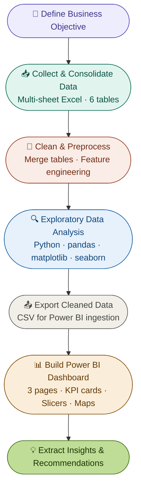
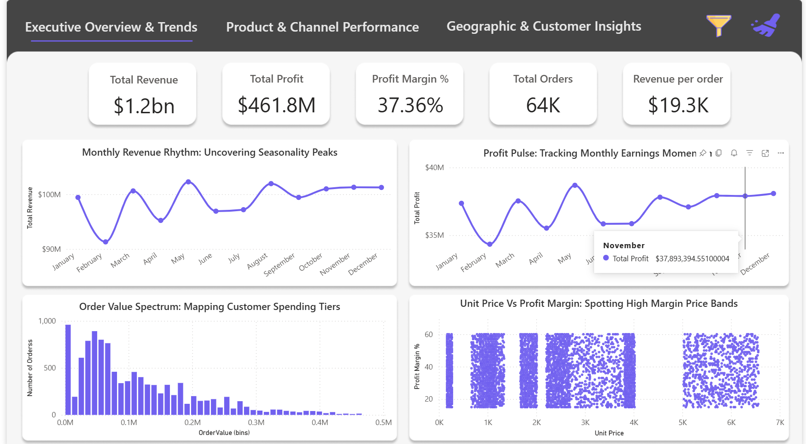
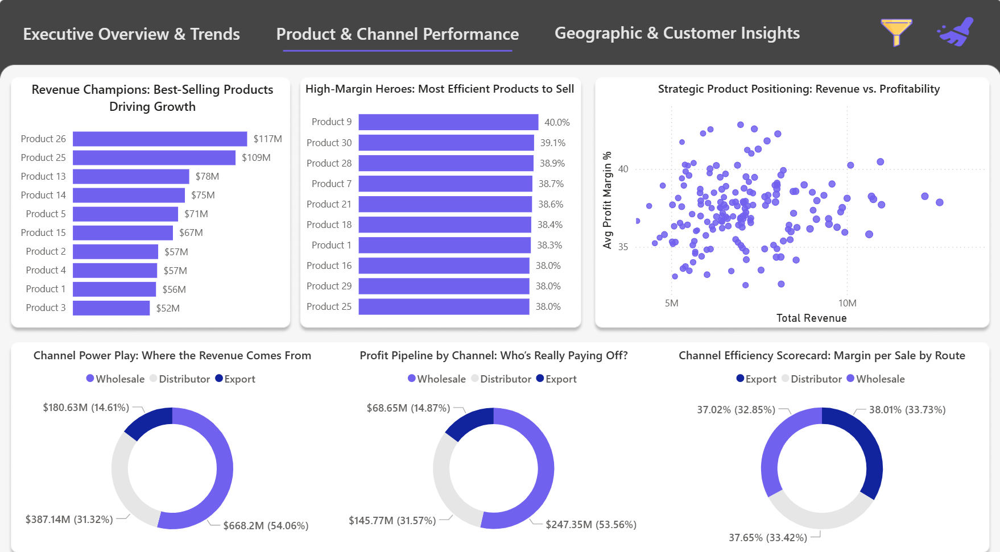
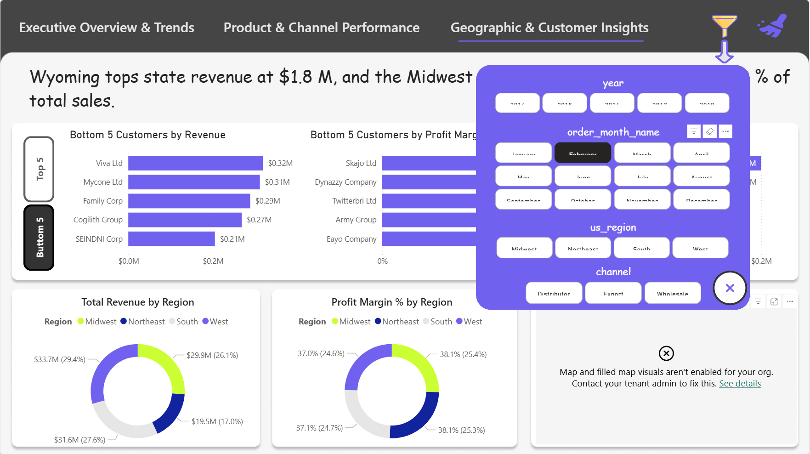
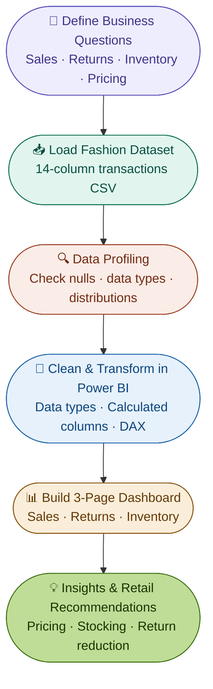
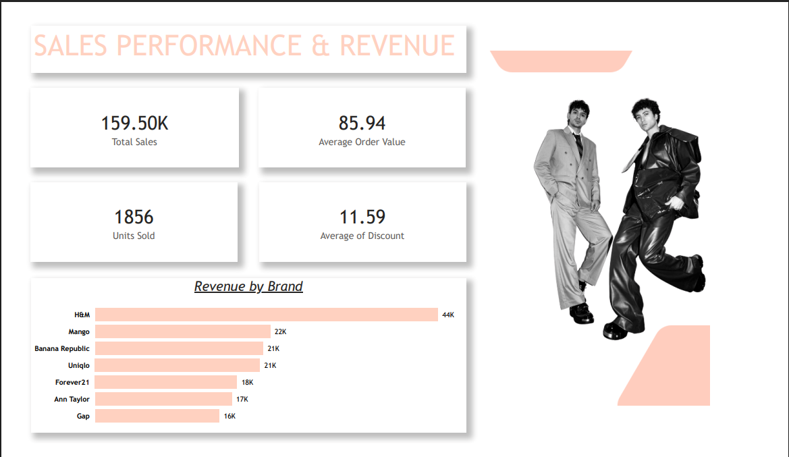
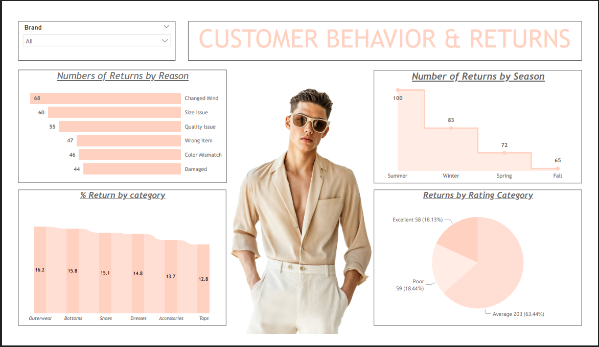
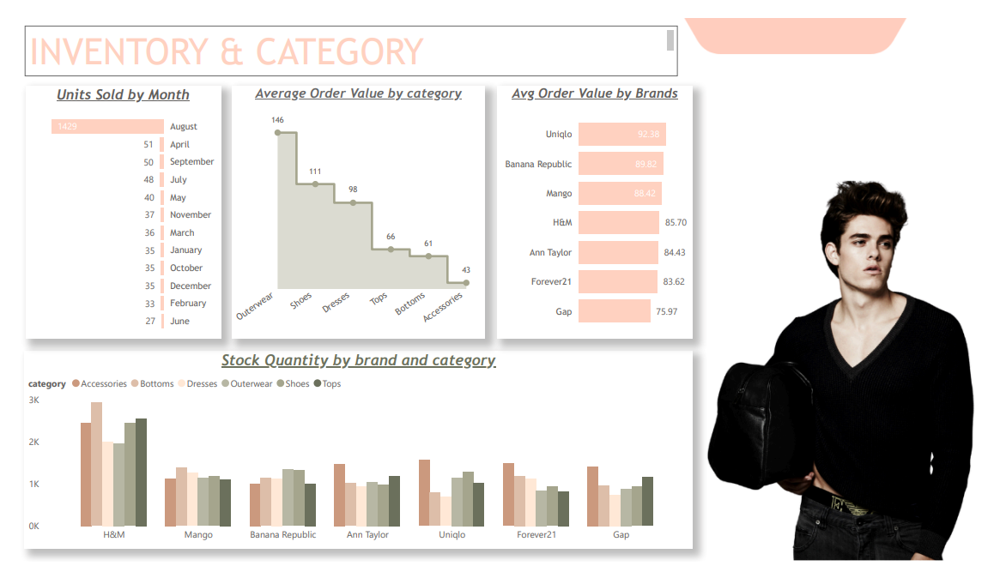

# 📂 Sales Analysis Portfolio

> **Two end-to-end analytics projects** — Python EDA + Power BI dashboards across industries (B2B Sales & Fashion Retail), demonstrating a full pipeline from raw data to business recommendations.

[](https://python.org)
[](https://powerbi.microsoft.com)
[](https://pandas.pydata.org)
[]()

---

## 👤 About

**Nihal Jaiwal** — Aspiring Data Analyst with hands-on experience building end-to-end analytics pipelines, interactive BI dashboards, and translating raw data into actionable business insights.

📧 nihaljaisawal1@gmail.com &nbsp;|&nbsp; 🔗 [LinkedIn](https://www.linkedin.com/in/nihal-jaiswal-908b52257/) &nbsp;|&nbsp; 💻 [GitHub](https://github.com/Nihal108-bi)

---

## 🛠️ Core Skills

| Skill Area | Tools & Technologies |
|------------|---------------------|
| Data Wrangling | Python (pandas, numpy), Excel |
| Visualisation & EDA | matplotlib, seaborn, Power BI |
| BI Dashboards | Power BI Desktop (.pbix), DAX measures, KPI cards |
| Data Storytelling | Insight extraction, business recommendations |
| Notebook Environment | Google Colab, Jupyter |
| Version Control | Git, GitHub |

---

## 📋 Projects at a Glance

| # | Project | Domain | Tools | Key Output |
|---|---------|--------|-------|------------|
| 1 | [Regional Sales Performance Analysis](#project-1--regional-sales-performance-analysis) | B2B Sales | Python + Power BI | $1.2bn revenue dashboard · 15+ EDA analyses |
| 2 | [Fashion Retail Analytics & BI Dashboard](#project-2--fashion-retail-analytics--bi-dashboard) | Retail / Fashion | Power BI | 3-page dashboard · Returns & inventory insights |

---

<br>

# Project 1 — Regional Sales Performance Analysis

> End-to-end Python EDA + Power BI dashboard surfacing **$1.2 bn** in Acme Co. sales data across 5 years, 4 U.S. regions, 30+ products, and 3 sales channels.

### 📁 Folder Structure

```
project-1-regional-sales/
├── data/
│   ├── raw/                          # Original Excel workbook (6 sheets)
│   └── processed/                    # Cleaned & merged dataset (CSV)
├── notebooks/
│   └── EDA_Regional_Sales_Analysis.ipynb
├── dashboards/
│   └── Regional_Sales_Dashboard.pbix
├── reports/
│   └── PPT_Regional_Sales_Analysis.pptx
└── images/
    ├── p1_executive_overview.png
    ├── p1_product_channel.png
    └── p1_geo_customer.png
```

---

### 🧩 Business Problem

Sales teams lacked a clear, data-driven view of regional performance — no visibility into seasonal revenue swings, top-performing SKUs, or channel profitability. The goal was to build a self-serve analytics solution using 5 years of historical data.

---

### 📦 Dataset Overview

| Attribute | Detail |
|-----------|--------|
| Source | Multi-sheet Excel workbook |
| Tables | Sales, Customers, Products, Regions, State-Region, Budgets |
| Period | 2014 – 2018 |
| Orders | ~64,000 |
| Total Revenue | $1.2 billion |
| Geography | All U.S. states · 4 regions |
| Channels | Wholesale, Distributor, Export |
| Products | 30+ SKUs |

---

### 🔄 Project Workflow



---

### 🧹 Data Preprocessing & Feature Engineering

1. Fixed incorrect headers on the State-Region mapping table
2. Merged 6 relational tables — Sales ← Customers, Products, Regions, State-Region, Budgets
3. Dropped redundant columns and standardised all names to lowercase
4. Restricted budget column to 2017 orders only
5. Engineered: `total_cost`, `profit`, `profit_margin_pct`, `order_month`, `order_month_name`

> ✅ Zero missing values or duplicate rows in the final dataset.

---

### 📊 EDA — Key Analyses

| # | Analysis | Chart | Finding |
|---|----------|-------|---------|
| 1 | Monthly revenue trend | Line | Jan ~$124M peak; April ~$95M dip |
| 2 | Monthly profit trend | Line | Nov profit at $37.9M |
| 3 | Order value distribution | Histogram | Right-skewed; most orders <$100K |
| 4 | Unit price vs margin | Scatter | Margin consistent across price bands |
| 5–7 | Channel splits (revenue/profit/margin) | Donut | Wholesale 54% volume; Export 38% margin |
| 8 | Product revenue ranking | Bar | Products 26 & 25 = $226M (~25% of total) |
| 9 | Product margin ranking | Bar | Product 9 tops at 40% margin |
| 10 | Revenue vs margin scatter | Scatter | Volume ≠ margin (low correlation) |
| 11–12 | Revenue & margin by region | Donut | West leads; all regions at ~37–38% margin |
| 13 | Top/Bottom customers by revenue | Bar | Aibox Company leads significantly |
| 14 | Customer segmentation | Scatter | $6–9M / >40% margin = upsell candidates |
| 15 | Correlation heatmap | Heatmap | Unit price drives revenue (0.91) & profit (0.79) |

---

### 💡 Key Insights

- **Seasonality:** January peaks at ~$124M; April troughs at ~$95M — a predictable $30M swing
- **SKU Concentration:** Products 26 & 25 alone drive ~25% of total revenue
- **Channel Trade-off:** Wholesale dominates volume (54%) but Export leads on margin (~38%)
- **Geography:** California = 7,600 orders / $230M — single largest state; Northeast is the growth opportunity
- **Pricing is the lever:** Unit price has 0.91 correlation with revenue — volume chasing won't improve margin

---

### ✅ Recommendations

| Priority | Action | Impact |
|----------|--------|--------|
| 🔴 High | Seasonal recovery campaigns in April–July | Reduce ±$30M revenue gap |
| 🔴 High | Double down on Products 26 & 25; phase out <35% margin SKUs | Portfolio efficiency |
| 🟡 Medium | Incentivise Export partnerships | Lift overall margin 1–2 pp |
| 🟡 Medium | Replicate California strategy in South & Midwest | Unlock regional demand |
| 🟢 Tactical | Review terms for $10M+ clients with <36% margin | Stop discount leakage |

---

### 📺 Power BI Dashboard — 3 Pages

**Page 1 — Executive Overview & Trends**



> KPIs: Total Revenue · Total Profit · Profit Margin % · Total Orders · Revenue per Order

| Visual | Insight |
|--------|---------|
| Monthly Revenue Rhythm | Seasonality peaks and troughs across 12 months |
| Profit Pulse | Monthly earnings momentum |
| Order Value Spectrum | Customer spending tiers histogram |
| Unit Price vs Profit Margin | High-margin price band identification |

---

**Page 2 — Product & Channel Performance**



| Visual | Insight |
|--------|---------|
| Revenue Champions | Top 10 products by total revenue |
| High-Margin Heroes | Top 10 products by average margin |
| Strategic Product Positioning | Revenue vs profitability scatter |
| Channel Revenue / Profit / Margin | Three donut charts — one per angle |

---

**Page 3 — Geographic & Customer Insights**



| Visual | Insight |
|--------|---------|
| U.S. Choropleth Map | Revenue intensity by state |
| Regional Revenue & Margin | Donut comparisons across 4 regions |
| Top/Bottom 5 Customers | Revenue and margin ranking |

> **Slicers:** Year (2014–2018) · Month · U.S. Region · Channel

---

<br>

---

<br>

# Project 2 — Fashion Retail Analytics & BI Dashboard

> Power BI dashboard analysing fashion retail performance across **7 brands**, **6 product categories**, and **4 seasons** — surfacing sales patterns, return behaviour, inventory gaps, and pricing insights.

### 📁 Folder Structure

```
project-2-fashion-retail/
├── data/
│   ├── raw/                          # Original fashion transactions dataset
│   └── column_definitions.xlsx       # Data dictionary (14 columns)
├── dashboards/
│   └── Fashion_Dataset_Dashboard.pbix
└── images/
    ├── p2_sales_revenue.png
    ├── p2_customer_returns.png
    └── p2_inventory_category.png
```

---

### 🧩 Business Problem

Fashion retailers face high return rates and unpredictable demand patterns across seasons and product categories. Without a consolidated view of sales velocity, return drivers, and inventory depth, it is impossible to make smart stocking and pricing decisions.

**Goal:** Build an interactive dashboard giving buyers, merchandisers, and ops teams a single source of truth for brand performance, return root causes, and category-level pricing strategy.

---

### 📦 Dataset Overview

| Attribute | Detail |
|-----------|--------|
| Records | 1,856 units sold |
| Brands | H&M, Mango, Banana Republic, Uniqlo, Forever21, Ann Taylor, Gap |
| Categories | Tops, Bottoms, Dresses, Outerwear, Shoes, Accessories |
| Seasons | Spring, Summer, Fall, Winter |
| Key Metrics | Sales revenue, AOV, discount %, returns, stock quantity, customer ratings |

**Data Dictionary (14 columns):**

| Column | Definition |
|--------|-----------|
| `product_id` | Unique product identifier |
| `category` | Product type (Tops, Bottoms, Dresses, Outerwear, Shoes, Accessories) |
| `brand` | Brand name |
| `season` | Target season |
| `size` | Product size (S, M, L, XL, numeric) |
| `color` | Product colour |
| `original_price` | Listed price before discount |
| `markdown_percentage` | Discount applied (%) |
| `current_price` | Final selling price after markdown |
| `purchase_date` | Transaction date |
| `stock_quantity` | Units available in inventory |
| `customer_rating` | Rating on 1–5 scale |
| `is_returned` | Whether item was returned (Yes/No) |
| `return_reason` | Customer-provided return reason |

---

### 🔄 Project Workflow



---

### 📺 Power BI Dashboard — 3 Pages

**Page 1 — Sales Performance & Revenue**



**KPI Cards:**

| Metric | Value |
|--------|-------|
| Total Sales | 159.50K |
| Average Order Value | $85.94 |
| Units Sold | 1,856 |
| Average Discount | 11.59% |

| Visual | Insight |
|--------|---------|
| Revenue by Brand (horizontal bar) | H&M leads at 44K — 2× nearest competitor Mango (22K) |
| Brand slicer | Filter entire page by brand for focused analysis |

---

**Page 2 — Customer Behavior & Returns**



| Visual | Insight |
|--------|---------|
| Returns by Reason (bar) | Changed Mind #1 (68) · Size Issue #2 (60) · Quality Issue #3 (55) |
| Returns by Season (bar) | Summer highest (100) · Fall lowest (65) |
| % Return by Category (area) | Outerwear 16.2% · Bottoms 15.8% · Tops 12.8% |
| Returns by Rating (pie) | Average-rated items = 63.4% of all returns |

---

**Page 3 — Inventory & Category**



| Visual | Insight |
|--------|---------|
| Units Sold by Month (bar) | August dominates at 1,429 — 28× the next month |
| AOV by Category (step/area) | Outerwear $146 vs Accessories $43 (3.4× gap) |
| AOV by Brand (bar) | Uniqlo $92.38 vs Gap $75.97 |
| Stock Quantity by Brand & Category | H&M largest overall; Accessories lowest across all brands |

---

### 💡 Key Insights

**1. 👑 Brand Dominance — H&M leads volume, premium brands lead value**
H&M generates 2× the revenue of Mango (44K vs 22K). But Uniqlo ($92.38) and Banana Republic ($89.82) command the highest average order values — indicating a premium positioning that yields more per transaction even at lower volume.

**2. 🔄 Returns are a Discovery Problem, Not a Quality Problem**
"Changed Mind" is the #1 return reason (68 returns) — this is an expectation-setting issue, not a product defect. Only 44 returns were due to damage, confirming strong fulfilment quality. Better product photography and size guides would address the top return driver directly.

**3. ☀️ Summer Return Spike Needs Attention**
Summer sees 100 returns — the highest of any season, 54% more than Fall (65). Summer sale promotions likely drive impulse purchases. Pairing promotions with clearer fit guidance and virtual try-on tools could reduce this.

**4. 🧥 Outerwear: Highest AOV + Highest Return Rate = Biggest Risk**
Outerwear is simultaneously the most expensive category ($146 AOV) and the most returned (16.2%). This combination represents the highest revenue leakage. Targeted quality investment and fit improvement here would have disproportionate financial impact.

**5. 👜 Accessories: Underpriced & Understocked — Clear Opportunity**
Accessories have the lowest AOV ($43) and appear consistently understocked across all 7 brands. As the lowest-return category (12.8%), they carry the least risk. Expanding accessories inventory and bundling with apparel purchases is a quick revenue win.

**6. ⭐ Average-Rated Items Drive 63% of Returns**
The majority of returns (63.4%) come from items rated "Average" — not "Poor". These are customers who almost said yes. Small product improvements in this segment could convert returns into repeat buyers and meaningfully improve net revenue.

---

### ✅ Recommendations

| Priority | Recommendation | Rationale |
|----------|---------------|-----------|
| 🔴 High | Improve Outerwear size charts, fit guides, and product imagery | Highest AOV + highest return rate = largest revenue leakage |
| 🔴 High | Add "Changed Mind" prevention features — 360° views, detailed descriptions | #1 return reason is an expectation gap |
| 🟡 Medium | Expand Accessories inventory across all 7 brands | Lowest returns + lowest stock = clear unmet demand |
| 🟡 Medium | Pair Summer promotions with fit and styling guidance | Summer = highest seasonal return volume |
| 🟡 Medium | Investigate and prepare for August demand spike | 1,429 units vs 27–51 in other months — validate and stock accordingly |
| 🟢 Tactical | Target Average-rated products for quality improvement | 63.4% of all returns originate from this segment |

---

<br>


*Built with Python 3 · Power BI · pandas · seaborn · Google Colab · Microsoft Excel*